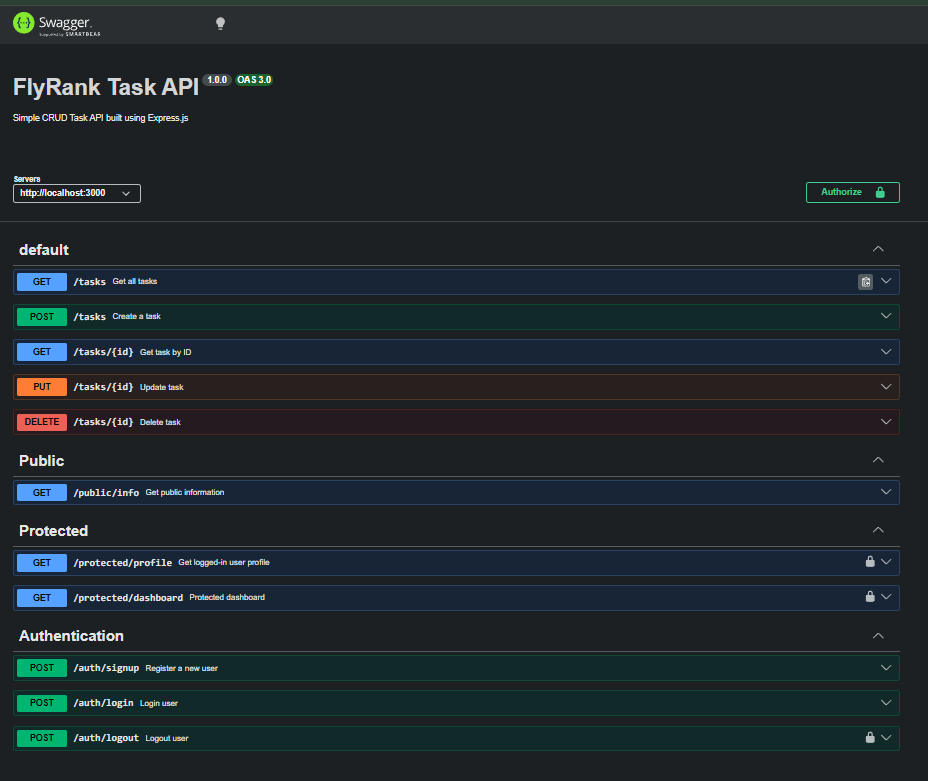

# FlyRank Secure Authentication API

## Project Overview

This project is a secure REST API built using **Node.js**, **Express.js**, and **Supabase Authentication**.

The API allows users to:

- Sign Up
- Login
- Logout
- Access Public Routes
- Access Protected Routes using JWT Authentication

Supabase is used as the Identity Provider (IdP) to securely manage users and generate JSON Web Tokens (JWT).

---

# Features

- User Registration (Signup)
- User Login
- User Logout
- JWT Authentication
- Protected Routes
- Public Routes
- Authentication Middleware
- Swagger API Documentation
- Environment Variables using dotenv

---

# Technologies Used

- Node.js
- Express.js
- Supabase Auth
- JWT (Supabase Access Token)
- dotenv
- Swagger UI
- Git & GitHub

---

# Project Structure

```
task_api
│
├── config/
│   └── supabase.js
│
├── middleware/
│   └── authMiddleware.js
│
├── routes/
│   ├── authRoutes.js
│   ├── protectedRoutes.js
│   ├── publicRoutes.js
│   └── taskRoutes.js
│
├── controllers/
│
├── swagger.js
├── server.js
├── package.json
├── .env
├── .gitignore
└── README.md
```

---

# Installation

Clone the repository

```bash
git clone https://github.com/Pranayunde/task_api.git
```

Go inside the project

```bash
cd task_api
```

Install dependencies

```bash
npm install
```

Create a `.env` file

```env
SUPABASE_URL=your_supabase_project_url
SUPABASE_KEY=your_supabase_anon_key
PORT=3000
```

Run the project

```bash
npm start
```

Server starts at

```
http://localhost:3000
```

Swagger Documentation

```
http://localhost:3000/docs
```

---

# API Endpoints

| Method | Endpoint | Authentication | Description |
|---------|----------|---------------|-------------|
| POST | /auth/signup | ❌ No | Register a new user |
| POST | /auth/login | ❌ No | Login user |
| POST | /auth/logout | ✅ Yes | Logout user |
| GET | /public/info | ❌ No | Public endpoint |
| GET | /protected/profile | ✅ Yes | User profile |
| GET | /protected/dashboard | ✅ Yes | Protected dashboard |
| GET | /tasks | ❌ No | Get tasks |
| POST | /tasks | ❌ No | Create task |

---

# Authentication Flow

1. User signs up using email and password.

2. User logs in.

3. Supabase returns:

- Access Token
- Refresh Token

4. Client sends

```
Authorization: Bearer <access_token>
```

5. Middleware verifies the token.

6. If valid:

- User can access protected routes.

Otherwise:

```
401 Unauthorized
```

---

# Status Codes

| Status | Meaning |
|---------|---------|
| 200 | Success |
| 201 | User Created |
| 204 | Logout Successful |
| 400 | Missing Input |
| 401 | Unauthorized |

---

# Swagger Documentation

Swagger UI is available at

```
http://localhost:3000/docs
```

Swagger supports Bearer Authentication.

Use the **Authorize** button to enter your Access Token before testing protected routes.

---

# Environment Variables

Create a `.env` file.

```
SUPABASE_URL=your_project_url
SUPABASE_KEY=your_anon_key
PORT=3000
```

Never upload your `.env` file to GitHub.

---

# Security

- Passwords are managed securely by Supabase.
- JWT Tokens are verified before accessing protected routes.
- Authentication logic is handled using reusable middleware.
- Sensitive credentials are stored in environment variables.

---

# Screenshot

Add your Swagger UI screenshot inside

```
images/
```

Example

```
images/swagger.png
```

Then display it using

```markdown

```

---

# Author

**Pranay Unde**

FlyRank AI Backend Internship