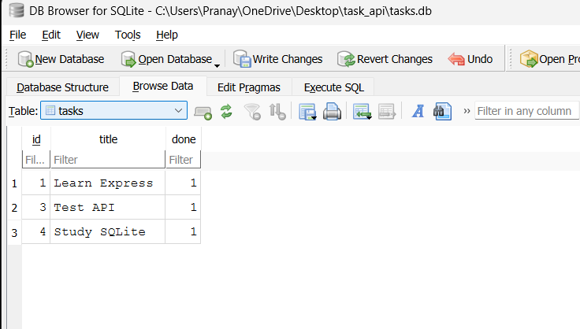

# Task API with PostgreSQL (Docker)

## Project Overview

This project is a RESTful CRUD Task API built using **Node.js**, **Express.js**, and **PostgreSQL** running inside **Docker**.

In the previous assignment, tasks were stored using SQLite. In this assignment, the storage layer has been migrated to **PostgreSQL**, providing a more powerful and production-ready relational database.

Docker is used to run PostgreSQL in a container, making setup simple and consistent across different systems.

The API endpoints remain exactly the same while only the database layer has changed.

---

## Features

- Get all tasks
- Get a task by ID
- Create a new task
- Update an existing task
- Delete a task
- PostgreSQL database
- Docker container support
- Environment variables using dotenv
- Data persists using Docker Volumes
- Swagger API Documentation

---

## Technologies Used

- Node.js
- Express.js
- PostgreSQL
- Docker
- pg
- dotenv
- Swagger UI

---

## Why PostgreSQL?

PostgreSQL was chosen because it is:

- Open-source
- Powerful relational database
- Highly reliable
- ACID compliant
- Supports advanced SQL features
- Used in many production applications
- Easily runs inside Docker containers

---

## Docker Setup

Pull the PostgreSQL image:

```bash
docker pull postgres:17
```

Run PostgreSQL container:

```bash
docker run --name taskdb ^
-e POSTGRES_PASSWORD=dev ^
-e POSTGRES_DB=tasks ^
-p 5432:5432 ^
-v taskdata:/var/lib/postgresql ^
-d postgres:17
```

Verify the container:

```bash
docker ps
```

Connect to PostgreSQL:

```bash
docker exec -it taskdb psql -U postgres -d tasks
```

---

## Database Configuration

Create a `.env` file in the project root:

```env
DB_HOST=localhost
DB_PORT=5432
DB_USER=postgres
DB_PASSWORD=dev
DB_NAME=tasks
```

---

## Database Schema

```sql
CREATE TABLE IF NOT EXISTS tasks (
    id SERIAL PRIMARY KEY,
    title TEXT NOT NULL,
    done BOOLEAN NOT NULL DEFAULT FALSE
);
```

---

## Project Structure

```text
task_api
│
├── controllers/
│   └── taskController.js
│
├── repositories/
│   └── postgresRepository.js
│
├── routes/
│   └── taskRoutes.js
│
├── images/
│   └── database.png
│
├── .env
├── server.js
├── swagger.js
├── package.json
├── package-lock.json
└── README.md
```

---

## Installation

Clone the repository:

```bash
git clone <your-repository-url>
```

Go to the project directory:

```bash
cd task_api
```

Install dependencies:

```bash
npm install
```

Start PostgreSQL using Docker:

```bash
docker start taskdb
```

Run the application:

```bash
node server.js
```

Server:

```
http://localhost:3000
```

Swagger Documentation:

```
http://localhost:3000/docs
```

---

## API Endpoints

| Method | Endpoint | Description |
|---------|----------|-------------|
| GET | / | Home |
| GET | /health | Health Check |
| GET | /tasks | Get all tasks |
| GET | /tasks/:id | Get task by ID |
| POST | /tasks | Create task |
| PUT | /tasks/:id | Update task |
| DELETE | /tasks/:id | Delete task |

---

## Example SQL Queries

Insert a task:

```sql
INSERT INTO tasks (title, done)
VALUES ('Learn PostgreSQL', false);
```

View all tasks:

```sql
SELECT * FROM tasks;
```

Example Output:

```text
 id |       title        | done
----+--------------------+-------
 1  | Learn PostgreSQL   | false
```

---

## Database Screenshot

Save your PostgreSQL table screenshot inside the `images` folder.

Example:

```text
images/
   database.png
```

Add this line to display it:

```markdown

```

---

## Persistence

The PostgreSQL database stores data permanently using a Docker Volume.

Restarting the server or Docker container does **not** delete existing tasks.

Data remains available until the Docker volume is removed.

---

## Swagger Documentation

Interactive API documentation is available at:

```
http://localhost:3000/docs
```

Swagger UI allows you to test all API endpoints directly from the browser.

---

## Author

**Pranay Unde**

FlyRank Backend Internship